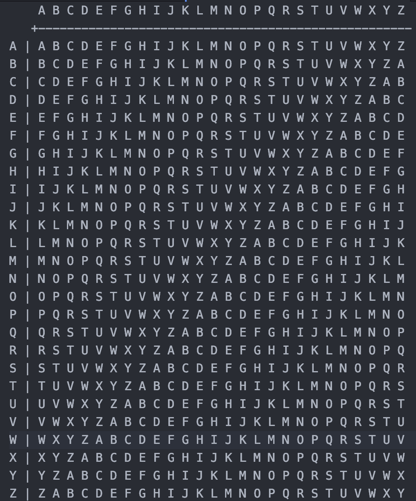

# Easy1
> The one time pad can be cryptographically secure, but not when you know the key. Can you solve this? We've given you the encrypted flag, key, and a table to help UFJKXQZQUNB with the key of SOLVECRYPTO. Can you use this table to solve it?.

In order to identify the solution to this problem, it is important to understand what pico is providing us with, so lets take a look at that.

Key `SOLVECRYPTO`

Encrypted Flag `UFJKXQZQUNB`

Pico also provides us with a table to help us decode this message. Here is what it looks like.

 

 Because we have a table of characters and is looks to be some sort of polyalphabetic cipher we can guess that this might be a Vigenère Cipher. It is important that you begin to be able to recognize different types of ciphers. It will save you a lot of time and trouble. Try out [PracticalCryptography](http://practicalcryptography.com/cryptanalysis/text-characterisation/identifying-unknown-ciphers/) to get an idea of the different ciphers. Also try out [this](https://www.boxentriq.com/code-breaking/cipher-identifier) cipher identifier tool if you are having trouble.

 If you want to do this problem by hand here is how we can do it. Xs will represent unknown characters. The encrypted message is the always the same length as the decrypted message.

 `SOLVECRYPTO` <-- Key

 `XXXXXXXXXXX` <-- Decrypted Text

 `UFJKXQZQUNB` <-- Cipher Text

 We can begin to work the table backwards by finding the S on one side then finding the corresponding cipher character in the table.

 `SOLVECRYPTO` <-- Key

 `CRYPXXXXXXX` <-- Decrypted Text

 `UFJKXQZQUNB` <-- Cipher Text

 We can start to see how the message is appearing. Keep doing it by hand to see what the flag is, if you get tired, try the [cryptii](https://cryptii.com) tool for Vigenère ciphers.

 Once we solve the cipher we see that the flag is `picoCTF{CRYPTOISFUN}`
