# VirtualBox Tutorial

Virtual machines are super useful! They allow users to create isolated environments for testing, running software that the host machine can't, privacy reasons, and many more. Here at UGASCS we mainly use our VMs to host all of the tools we need for CTFs and other cyber events. We mainly use a Linux distro called [Kali Linux](https://www.kali.org/). Kali Linux is maintained by a company called [Offensive Security](https://www.offensive-security.com/) who specialize in offsec training materials and certifications, you may have heard about the OSCP, ya that's them. Kali also come with tons of great tools preinstalled guaranteed (most of the time) to work with ease. It is helpful to have a VM to prevent clutter on our host machine and also a lot of the tools we are going to be using were developed for the Linux environment.

Okay now that you know why we use virtual machines, let's move forward with how to set one up. First off take a look at the prerequisites and the system requirements below. After you download the required files come back here and continue the tutorial.

## Prerequisites and System Requirements
- [Kali Linux 64-Bit (Installer)](https://www.kali.org/downloads/)
- [VirtualBox and Extension Pack](https://www.virtualbox.org/wiki/Downloads)
- 4GB of RAM
- 30 GB of free storage space

Now that  you have downloaded all the required software, go ahead and install VirtualBox and when it asks you to install the extension pack do so as well. If you are not prompted to install the extensions see [How to Install Extensions Pack](#How-to-Install-Extensions-Pack) otherwise skip this step to [How to Add a New Guest Machine](#How-to-Add-a-New-Guest-Machine).

## How to Install Extensions Pack

First click on the `Preferences` button at the top of the `Tools` window.

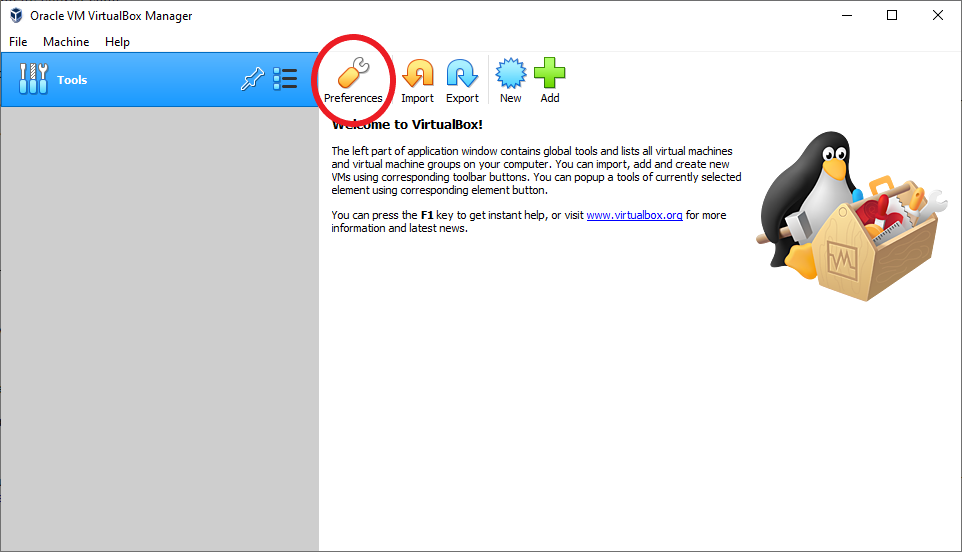

After clicking on `Preferences` button a new window should pop up that has an extensions tab to click on.

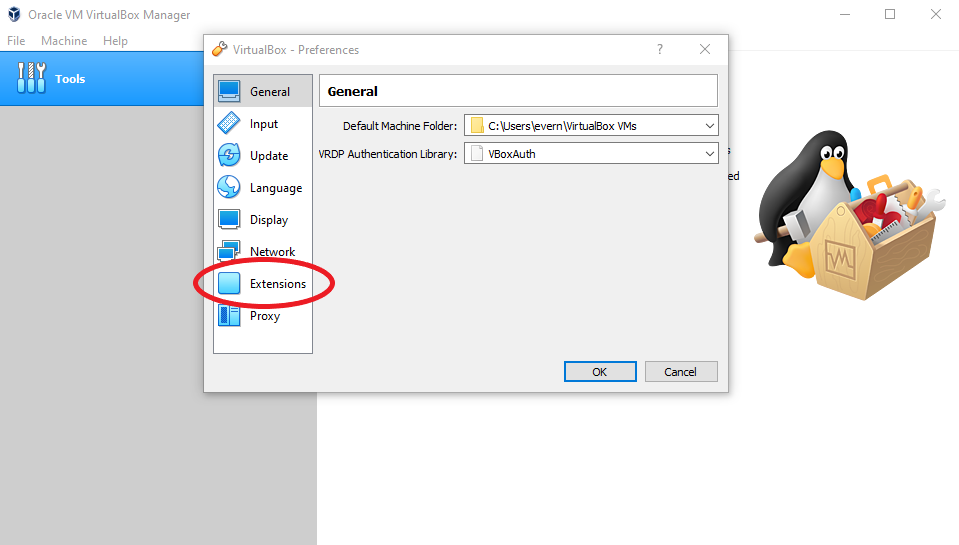

Next, click on the rounded blue square on the right side with the green `+` in it.

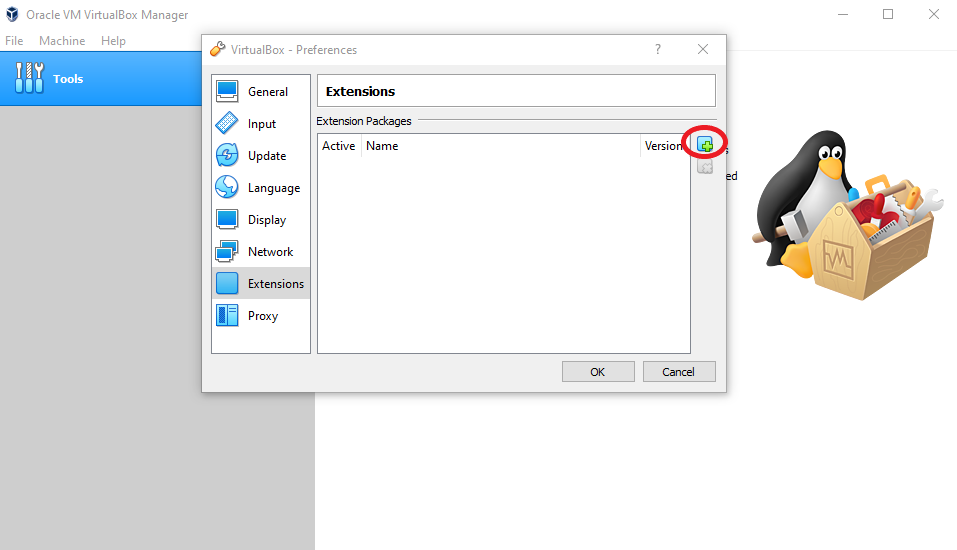

Now navigate to the location of your navigation pack, select it, click install, and agree to the terms of service. You should get a message saying that the extension pack was successfully installed and it should show up in the extensions tab.

## How to Add a New Guest Machine

Great, so you have VirtualBox downloaded and the extension pack added! Now let's get the a guest machine installed. For this you will be using the Kali Linux `.iso` you downloaded earlier.

Start off be selecting `New` in the `Tools` tab.

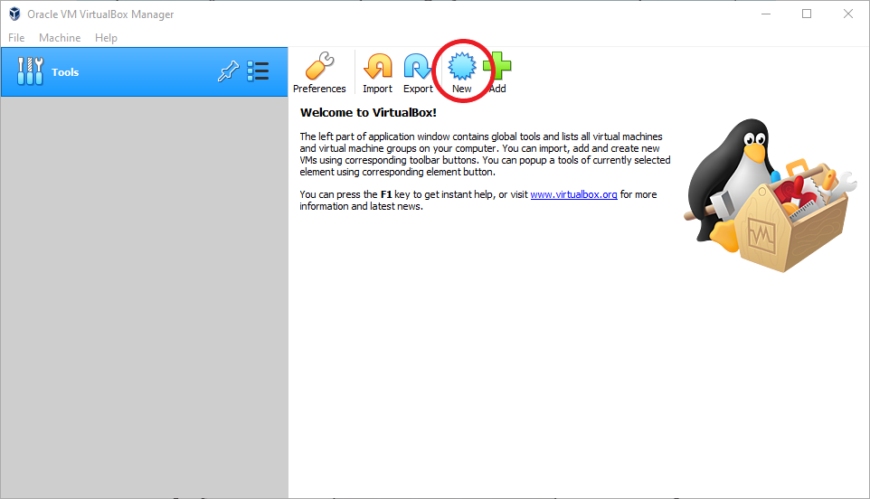

Once the `Create Virtual Machine` window pops up you need to name our machine, select it's OS type, and version. You can name your new VM whatever you want however, the type is `Linux`, and the version is `Debian (64-Bit)`.

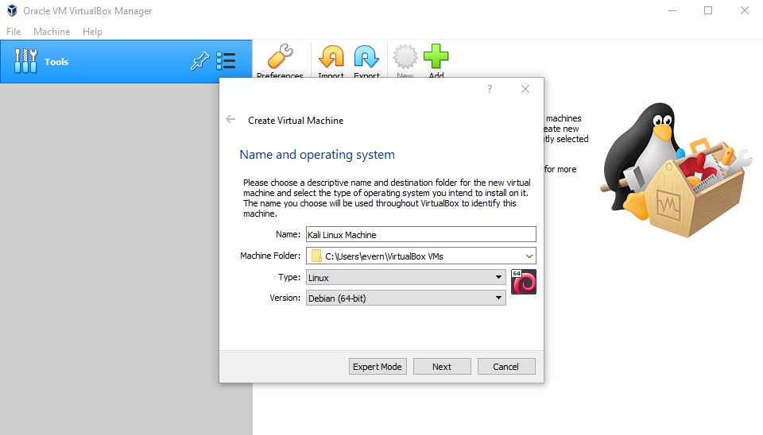

Next, you need to allocate memory to the VM, this RAM will only be used by the VM when it is on, not all the time. The system requirements for Kali Linux have a minimum of 1GB of RAM however this might cause your VM experience to be a little less than desirable. 2GB or more is recommended, however 4GB is a very good amount.

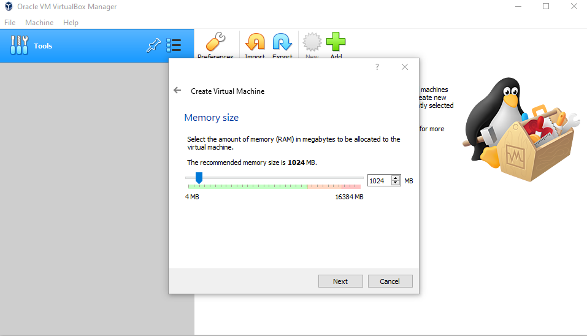

In the next menu, select `Create a virtual hard disk now`, then VDI (Virtual Disk Image) in the next menu. Next, if you only want the VM to use the space you allocate as it needs select `Dynamically allocates`, otherwise the disk space will be reserved on creation with `Fixed size`. After selecting a storage mode we are greeted with a menu to allocate storage to our virtual machine. Kali requires at least 20GB of space for the install, however if you install it with all of the tools, you are better of to go with 40GB or more so that you have space for the files you put on there.

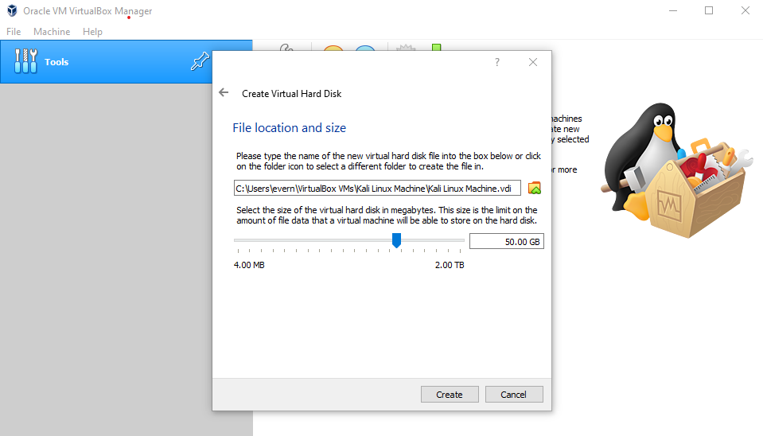

Finally hit create! Great we did it... almost. Click on the `Settings` button inside of the VM you just created.

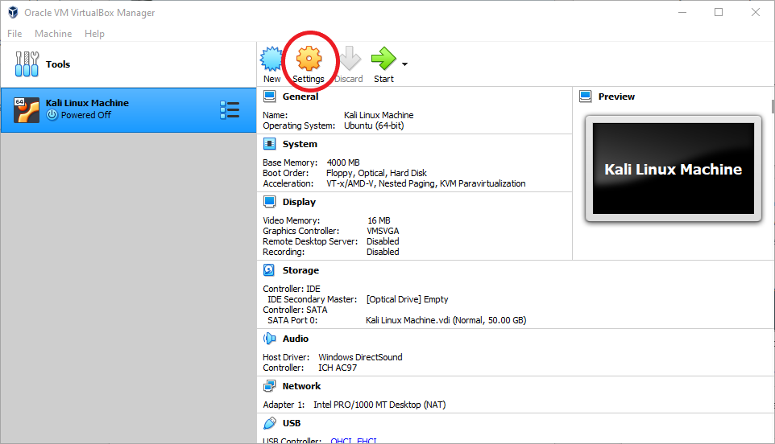

Inside of the settings navigate to the `Storage` tab. Then click the disk with the green `+` in it next to `Controller: IDE` and click `Add` in the new popup window to add the Kali Linux `.iso`.

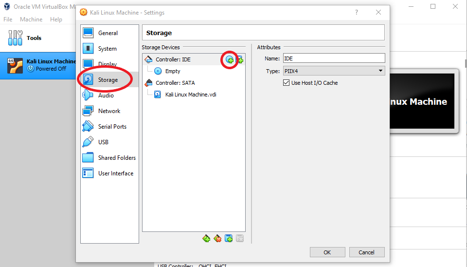

Now that we have added the `.iso`, navigate to the `Display` tab and max out the `Video Memory` to 128MB.

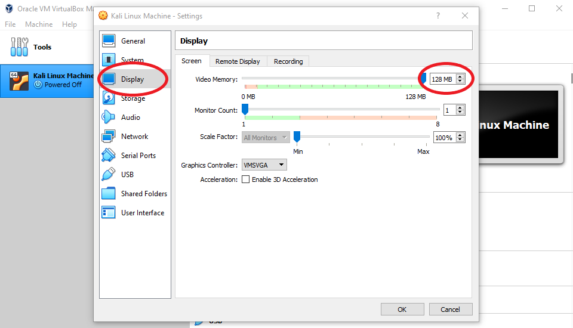

Finally if you have a 4 core or more processor go to the `System` tab then to the `Processor` tab and increase the number of CPU cores dedicated to the VM to 2. This will make the overall VM run smoother.

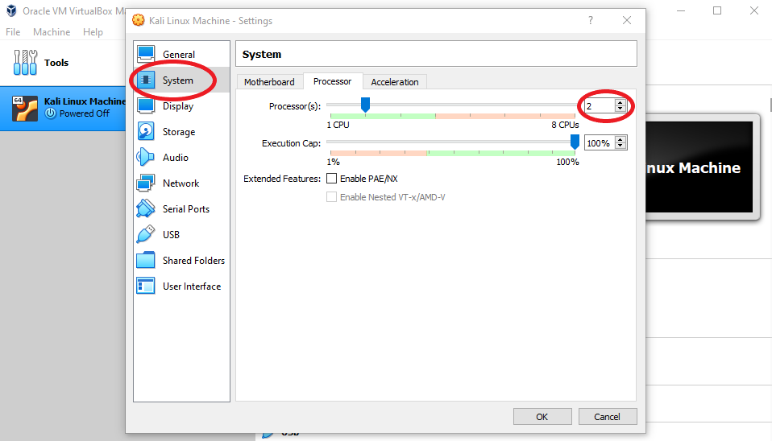

Hit `OK` to save the changes and you are done! You have successfully set up the guest machine. The last step is to set up Kali then you are done! Just start the machine and run through the installer!
